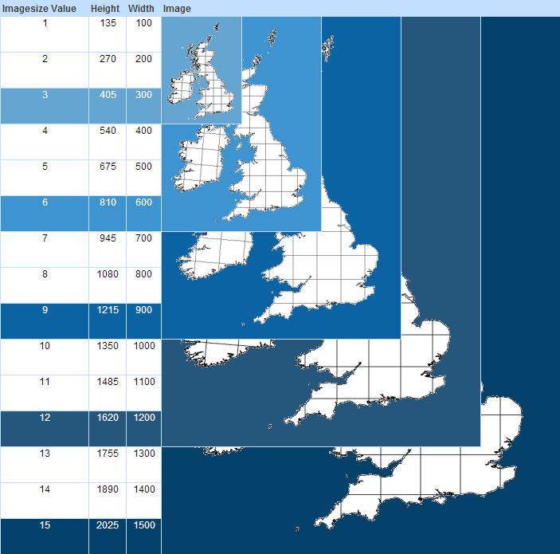

# Dynamo Mapping

Dynamo mapping is a plug-in for your spring mvc application to create dynamic maps powered by mapserver.
        
It is deployed in maven central and can be pulled in using:

    <dependency>
        <groupId>uk.ac.ceh</groupId>
        <artifactId>dynamo-mapping</artifactId>
        <version>0.5</version>
    </dependency>

At the core of dynamo mapping is the **MapServerViewResolver** which processes templated map files and posts them to a map server instance (along with the Query String of the request) and returns the result to the client.

Once configured, Dynamo works just like any other spring mvc view resolver.

    @RequestMapping("my-map/{service}")
    public ModelAndView getViewForMyMapService(
        @PathVariable("service") String serviceName,
        @RequestParam("customParameter") String custom
        ) {
        ...
        return new ModelAndView("my-templated-mapfile.map", model);
    }

In order to enable to view resolver, you must register the **MapServerViewResolver** as a spring bean in your application context. If you are using the Spring JavaConfig (which you should be), then you can register like this:

    @Bean
    public MapServerViewResolver configureMapServerViewResolver() throws IOException {
        return new MapServerViewResolver(httpClient, new File("location/of/map/files"))), new URL("http://localhost:9000/fcgi-bin/mapserv.exe")));
    }

I would recommend that you enable fcgi on your mapserver. If you are using the [ms4w](http://www.maptools.org/ms4w/) then details on how to set this up can be found [here](http://www.maptools.org/ms4w/index.phtml?page=README_INSTALL.html#f-fastcgi)

# Grid Mapping

Dynamo Mapping also has the capability to generate pixel perfect grid maps for projection systems which are based upon a grid. Examples of these are *EPSG:27700* and *EPSG:29903*. The intention is that the grid maps should be easy to [call and interact](#calling-a-grid-map) with.

To enable grid mapping simply register the **GridMapRequestMappingHandlerMapping** as a spring bean, e.g.

    @Bean
    public GridMapRequestMappingHandlerMapping gridMap() {
        return new GridMapRequestMappingHandlerMapping();
    }

And then on your spring controllers which can respond as WMS's (e.g. ones powered by the **MapServerViewResolver**) apply the GridMap annotation and configure accordingly. Once done you should have an mvc controller a bit like this:

    @GridMap(
        layers={
            @GridLayer(name="10km",     layer=TEN_KM_LAYER_NAME,        resolution=Resolution.TEN_KM),
            @GridLayer(name="2km",      layer=TWO_KM_LAYER_NAME,        resolution=Resolution.TWO_KM),
            @GridLayer(name="1km",      layer=ONE_KM_LAYER_NAME,        resolution=Resolution.ONE_KM),
            @GridLayer(name="100m",     layer=ONE_HUNDRED_M_LAYER_NAME, resolution=Resolution.ONE_HUNDRED_METERS)
        },
        defaultLayer="10km",
        overlays=@Layer(name="feature", layers="Selected-Feature" )
    )
    @RequestMapping("my-map/{service}")
    public ModelAndView getSingleSpeciesModel(...){}

Once enabled, you will get 3 new resources registered, in the above example these will registered at:

* my-map/{service}/map - generates grid map images 
* my-map/{service}/legend - generates legends
* my-map/{service}/resolutions - states which image sizes allow for which resolutions

## Calling a grid map

### Grid Map Parameters

#### background & overlay [map]

You can add a background and foreground layers to your grid map which don't need to be snapped to a grid. The valid values for this are dictated in the @GridMap annotation. You can provide a simple name for your layer which will be the value supplied when calling. That value can map to one or many of the layers which your wms can generate.

#### imagessize - defaults to 10 [map]

Grid map images don't allow you to supply any old height and width parameters. Instead you can optionally supply an imagesize value.

A valid value for the image size parameter is an integer from 1-15 inclusive. Each of these images size produces a fixed resolution image for the viewport to be viewed. The viewport to view is manipulated with the *feature* and *nationalextent* parameters. A table of image size to resolution is provided below for the grid map default national extent. Please note that the images in the table below are a third of their actual size.

The image size fills in the wms parameters for HEIGHT and WIDTH

#### format - defaults to png [map and legend]

The format parameter specifies the type of image which will be generated from the Grid map service, currently there are only three valid outputs. These are:

png - Portable network graphics image
gif - Graphics Interchange format
jpeg - JPEG image

The format will fill in the WMS parameter FORMAT.

#### feature & nationalextent [map and resolutions]

The feature and nationalextent parameters change the viewport and epsg code which will be used when rendering the grid map image. If a FeatureResolver is defined as a bean then you will be able to use the feature parameter to dynamically resolve bounding boxes. This is useful if it is unreasonable to specify all of the national extents statically in the grid map annotation.

You can use the nationalextent parameter to focus in on locations specified in the grid map annotation.

The feature parameter takes precedence over nationalextent. Both of these parameters fill in the WMS parameters for SRS and BBOX.

## Reading GridMap Images

If you know the grid map request which was used to generate a particular grid map image, you can use the **GridMapImage** class to process that image and read off which Grid Squares are present and what colour they are.

A fluent api **GridMapImageBuilder** is also available to simplify this task obtain the grid map image from a deployed GridMap service. If the code which is powering the grid map service is available, you can read off the annotation and supply this to the builder.
  
    WebResource resource = ... create jersey client resource to deployed grid map

    //use spring reflection utils to obtain the grid map annotation
    GridMap map = ReflectionUtils.findMethod(MyMapService.class, "methodName", (Class<?>[]) null)
                                 .getAnnotation(GridMap.class);
    GridMapImage = new GridMapImageBuilder(resource, map)
                          .imageSize(12)
                          .resolution("GridMapResolution")
                          .feature("a feature to zoom to")
                          .nationalExtent("or the nationalExtent")
                          .build();

# Bread - Or How I Learned to stop worrying and love the cache

Bread is a double buffered caching mechanism which has been designed for caching cuts (or bread slices) of data from a slow preparation source. For example, cache an sql query to a shapefile (see uk.ac.ceh.dynamo.bread.ShapefileGenerator)

To use, create an instance of a Bakery. If you are planning on caching spatial queries to shapefiles in your dynamo mapping web application, then you would create a spring bean Bakery in your ApplicationContext:

        @Bean
        public ShapefileBakery shapefileBakery() {
            //Create a shapefile generator, this will back onto an installation of ogr2ogr
            ShapefileGenerator shapefileGenerator = new ShapefileGenerator(
                ogr2ogrLocation,
                ogr2ogrConnectionString,
                maximumAmountOfSimultaneousConnections);

            return new ShapefileBakery(
                new File("location/to/cache/directory"),
                new BreadSliceCountClimateMeter(512),    //A climate which scaled with the slices of bread
                shapefileGenerator,
                30000,                                   //Time in miliseconds for bread to go stale
                150000                                   //Time in miliseconds that in the best climate, bread will go mouldy
            );
        }

Simply inject this bean into your Dynamo Mapping controller and when preparing your mapfile template, call the getData method on your bakery. The result of this call will be a shapefile on disk with the data prepared from your sql statement.

Similar sql queries will return the same shapefile until that shapefile has been either:

1. Regenerated because it was requested after it went stale
2. Went mouldy and was not fit for consumption

Underlying all of this is the concept of a bread slice. A bread slice is a wrapper around the query (known generically as ingredients). At any time a bread slice can be in any one of four states.

1. Conceived of but not yet baked.
2. Freshly baked (i.e. not yet stale)
3. Gone stale, a given amount of time has elapsed since the shapefile was populated. We can still serve from this bread slice but we will also request a fresh slice to be baked in the background
4. Mouldy. The bread slice is not fit for consumption. This will be because either the time has elapsed in which it takes for this slice of bread to go mouldy in the best climate or the current climate is not suitable for keeping bread. In any case, this slice of bread will be scheduled for deletion.

The default bakery is coded to be thread safe. Like any caching mechanism, Bread works best with lots of similar requests for data being made.

The code base is well documented with Javadoc. If you which to investigate the inner workings in more depth I would recommend beginning at uk.ac.ceh.dynamo.bread.Bakery

## Contributors

- [Christopher Johnson](https://github.com/chrisjohnson1988)
